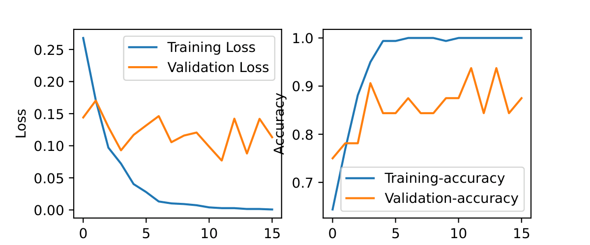
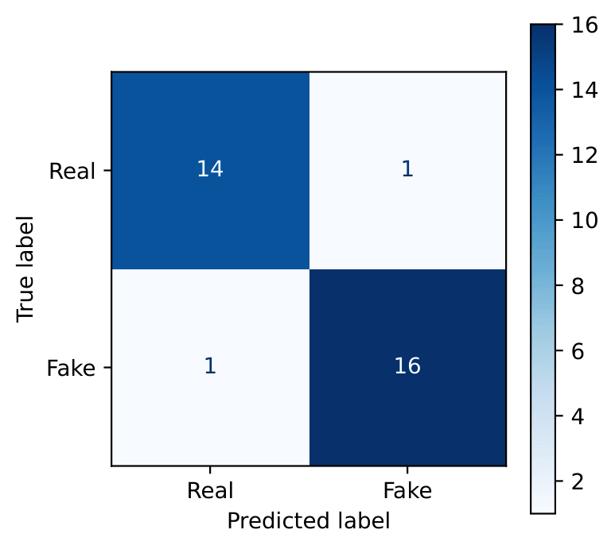
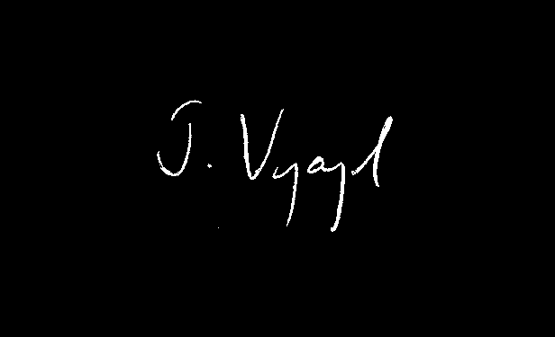
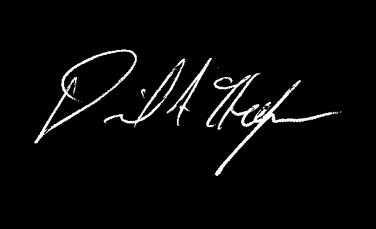
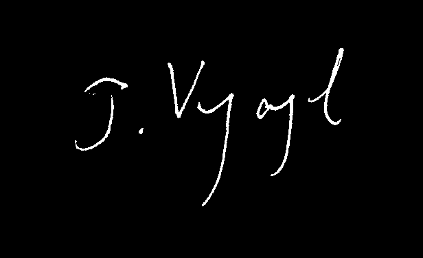
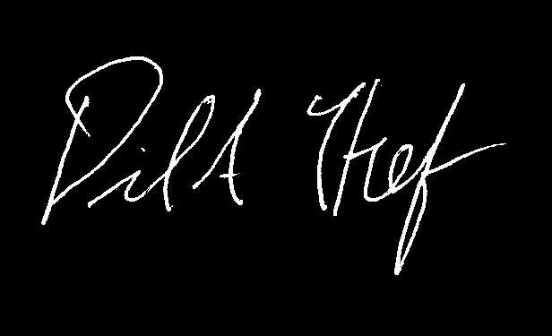
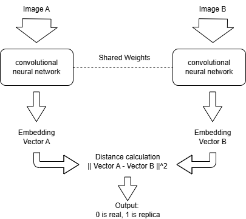
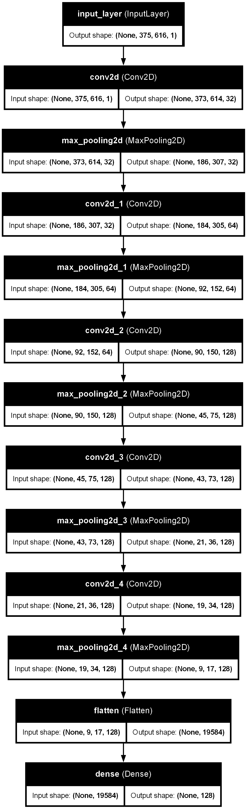

# Signature Forgery Detection (SFD)

This repository implements an offline Signature Forgery Detection system using deep learning. Because some data such as pen pressure and writing speed are unavailable in scanned documents, this system relies on extracting features from static grayscale images. This code is my solution to a voluntary assignment in NTNU course TFY4235 Nummerical Physics.

## Dataset and Results

The model achieves a high success rate despite being trained on a relatively small dataset. The dataset consists of 32 unique writers, with 4 genuine signatures and 4 forged signatures per person. To ensure strict evaluation, the dataset is split by writer identity. 22 writers are used for training, 5 for validation, and 5 for independent testing. 

The Siamese network reaches a validation accuracy between 80% and 90% and minimize the false positives.

**Training Metrics:** 

**Test Evaluation:** The Confusion Matrix on unseen writers shows only one false positive and one false negative. 

## The Signatures

The dataset consists of paired images, genuine signatures and good forgeries. The primary challenge is to teach the model to ignore the natural variations in a person's handwriting, while seeing the structural errors in forgeries.

**Genuine Signature:** 



**Forged Signature:**   



## The Model Architecture

The core of this project is a **Siamese Convolutional Neural Network (CNN)**. 

Instead of classifying a single signature directly, the Siamese architecture takes a pair of signatures as input. Both images are passed through identical CNN branches that share the exact same weights. The network applies multiple layers of Convolution and Max Pooling to extract hierarchical features, eventually compressing the data into a 128-dimensional embedding vector.

**Base CNN Architecture:**



Once the two embedding vectors are generated, the network calculates the Euclidean distance between them. The model is trained using a Contrastive Loss function, which penalizes the network if the distance between two genuine signatures is too large, or if the distance between a genuine signature and a forgery is too small.

**Full Siamese Network:** 



## Setup and Installation

To run this model, data pipeline, and evaluation metrics locally I recommend using the package manager uv.

1. Clone this repository.
2. Install uv

```bash
pip install uv
```

3. Install depencies
```bash
uv sync --link-mode=copy
```

4. Run
```bash
uv run main.py
```