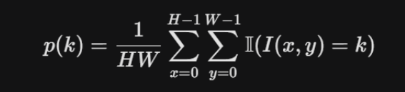
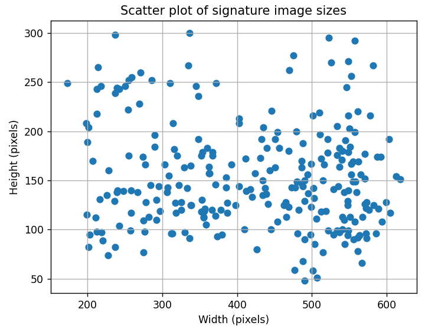

# task 2
## 2a
Fra felt til matrise: Verdien i punkt (x,y) settes inn i matrisen på rad i = x, og kolonne j = y

Fra matrise til vektor: element fra matrisen på m(i,j) går til vektoren med å bruke formelen v_k, k = i*W + j

Invers mapping fra vektor til matrise: i = k//W (heltalldivisjon gir raden) j=k%W, mododulo gir kolonnen

## 2b
D(s1, s2) = sqrt(sum(n,i=1) ((fs1) - f(s2))^2)

Dette gir forskjellen i intensitet for to bilder for piksel per piksel intensitet. Med lav euclidian differanse så har en en lignende signatur. 

- Det er likevel noen drawbacks med å bruke denne metoden, den er følsom til forskyvning av signaturen, en liten forskyvning vil endre hele distansen mellom to signaturer,

- Det er også forskjell på signaturer fra samme person. med variasjon fra signatur til signatur. Det kan være forskjeller i strektykkelse og form.

- Den er også begrensende med at den kun ser på pikselverdier og ikke på streker eller andre trekk.

## 2c

### task 2 c

1. Numerisk stabilitet (Gjennomsnitt og normalisering)Valget mellom 8-bit heltall (uint8) og flyttall (float) i området $[0, 1]$ har store konsekvenser for stabiliteten i matematiske operasjoner:8-bit heltall ($\{0, \dots, 255\}$):Overflow (Overflyt): Ved beregning av gjennomsnitt må man summere pikselverdier. I et bilde med mange piksler vil summen raskt overstige 255, som er maksgrensen for en 8-bit variabel. Dette fører til feilaktige "rulling" av verdier (f.eks. at $255 + 1 = 0$).Presisjonstap: Divisjon med heltall fører til avrundingsfeil. Hvis du deler en pikselverdi på et tall for å normalisere, vil resultatet ofte bli forkastet eller rundet ned til nærmeste heltall, noe som fjerner subtile nyanseforskjeller i signaturen.Flyttall ($[0, 1]$):Høy presisjon: Flyttall (som float32 eller float64) tillater desimaler, noe som er kritisk for operasjoner som normalisering til null gjennomsnitt og enhetsvarians.Stabilitet: Man unngår overflow-problemer ved store summeringer, og matematiske transformasjoner (som rotasjon eller konvolusjon) forblir nøyaktige uten at informasjon går tapt i avrunding.2. Tolkning av avstander og indreproduktHvordan vi ser på likheten mellom to signaturbilder endres basert på skalaen:Euklidsk avstand ($||I_1 - I_2||_2$):I en uint8-representasjon kan avstanden mellom to piksler være så stor som 255. Over et helt bilde (vektor i $\mathbb{R}^{HW}$) vil den totale avstanden bli et enormt tall som er vanskelig å tolke intuitivt.I en $[0, 1]$-representasjon er den maksimale avstanden per piksel 1. Dette gjør det lettere å sammenligne avstander på tvers av ulike datasett, da verdiene er uavhengige av den spesifikke bit-dybden til skanneren.Indreprodukt ($I_1 \cdot I_2$):Indreproduktet brukes ofte for å måle korrelasjon eller "overlapp" mellom to bilder.Ved bruk av verdier mellom 0 og 1 fungerer indreproduktet som et mål på hvor mye "blekk" som overlapper i de to signatur-vektorene. Hvis begge bildene er normalisert til å ha enhetslengde, vil indreproduktet direkte tilsvare cosinus-likhet, som er et standardmål for likhet i maskinlæring.Oppsummert: Flyttall i området $[0, 1]$ er nesten alltid å foretrekke for numeriske beregninger fordi det bevarer detaljer under transformasjoner og gjør matematiske likhetsmål (som avstander) mer konsistente og sammenlignbare.

# task 3
# 3a

# 3b
A histogram with B bins approximates this distribution by showing a differnce in the black and white colors of the image, the white color is the background and the black color is the actual text, this allows us to select out the text from the image, using a small number of bins can lead to noisy data, while choosing a lower number of bins will show a smoother bin history, the histogram might easier show where the different pixels.

# task 4
## 4a
The transformation for T[i](x,y) = 1-I(x,y) is linear for I(x,y) being a normalized grayscale image

## 4b
The relative positions of the pixel intensities will be symmetrically mirrored on 0.5 where 0.75 will become 0.25

## 4c 
This will effect the information available to a learning algorithm, there is a reason we want to normalize the image before we give it to the learning algorithm as it is more nummerically stable for floating point numbers between 0 and 1, and it is easier to do calculations from here.

## 4d 
Image inversion for images where there is a white background and black text is smart since it limits out data to being only the text, instead of the background, which could reduce the values we need to compute because we ignore the background perhaps?

# task 5
## 5a
Kernel A blurrs the image
Kernel B sharpens the image
Kernel C shows the right side edges of the image
Kernel D is the laplacian filter, it shows places where there are large changes in the direction of the image, a forager will make the signature slower leading to a 

# task 6
Chose a threshold at 200. Thresholding is useful since it allows us to view an image at two values 0 and 1 instead of 256 different one, this significantly reduces the amount of data that is stored per image. And could speed up the computation.

# task 7
## 7d
Nummerical stability and step size in finite differences
- The objective here is to get a good cropping so that the height is minimized to reduce the amount of data that we need to work with.

- Because we have interpolation and thresholding it is possible that for very small angular changes we can get no difference in the measured height leading us into a local minima.

- If h is too small the derivative becomes noisy and unstable or maybe even zero if one is unlucky.

- If it is too large we can miss local minima

- That is why it is smart to use an adaptive h, that is modulated down the closer we get to our minima.

## 7f

- Advantage, the biggest advantage with this is that we reduce the slight differences in rotation when someone writes their name. and we reduce the amount of data we look at.

- Disadvantage: We lose some information about the image, the interpolation that is done when we rotate the grayscale image does not match exactly. and we lose some of the data that could be useful for forgery detetection.

# task 9

image sizes:

